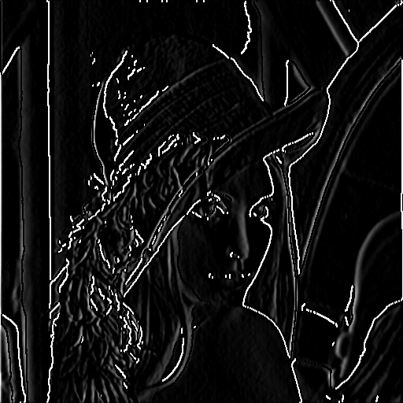
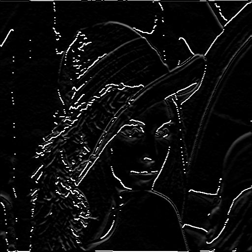
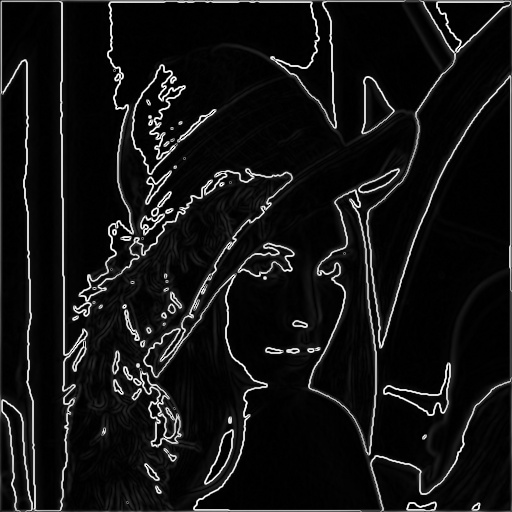
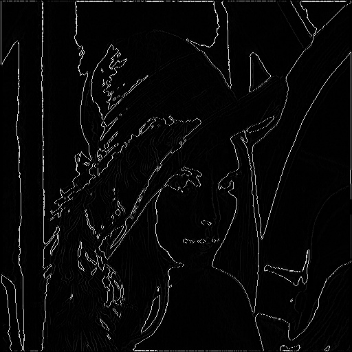

# 一步步用c++实现canny边缘检测

[TOC]


## 0.前言

作为新一篇的一步步用c++实现算法，本文从0用c++实现计算机视觉中较为常用的canny边缘检测算法，代码实现上不追求高性能，只为了帮助了解算法原理，通过最简单的实现加深对算法的理解。

## 1.Canny简介

​    **Canny边缘检测算子**是澳洲計算機科學家約翰·坎尼（John F. Canny）于1986年开发出来的一个多级[边缘检测](https://www.wikiwand.com/zh/%E8%BE%B9%E7%BC%98%E6%A3%80%E6%B5%8B)[算法](https://www.wikiwand.com/zh/%E7%AE%97%E6%B3%95)。更为重要的是Canny创立了“边缘检测计算理论”（computational theory of edge detection）解释这项技术如何工作 。——维基百科

## 2.算法步骤

canny边缘检测算法由五部分组成：

### 2.1.去燥

首先，我们先对图像进行高斯平滑处理，抑制噪声，防止后面计算梯度时，出现较大的梯度值。

<center class="half">
    
</center>

```c++
void gaussion_blur(cv::Mat &res_)
{
    cv::Mat kernel = gen_gaussion_kernel();
    res_ = filter(_img,kernel);
}
cv::Mat gen_gaussion_kernel()
{
    cv::Mat kernel = cv::Mat::zeros(cv::Size(_kernel_size,_kernel_size),CV_32FC1);
    for (int r = -_kernel_size/2; r < _kernel_size/2+1; ++r)
    {
        for(int c = -_kernel_size/2;c<_kernel_size/2+1;++c)
        {
            float v = gaussion(c,r,_delta);
            kernel.at<float>(r+_kernel_size/2,c+_kernel_size/2) = v;
        }
    }
    float sum = cv::sum(kernel)[0];
    return kernel/sum;           
}
```


### 2.2 计算梯度

梯度计算的计算主要是应用sobel算子，分求取x方向和y方向的梯度，进而得到图像的梯度强度图和梯度方向图。

<center class="half">
    
</center>

```c++
void calculate_gradient(cv::Mat &res_,cv::Mat &intensity_,cv::Mat &direction_)
{
    cv::Mat sobelx = (cv::Mat_<float>(3,3) << -1, 0, 1, -2, 0, 2, -1, 0, 1);
    cv::Mat sobely = (cv::Mat_<float>(3,3) << -1, -2, -1, 0, 0, 0, 1, 2, 1);
    cv::Mat gradientX = filter_float(res_,sobelx);
    cv::Mat gradientY = filter_float(res_,sobely);
    res_ = gradientX.mul(gradientX)+gradientY.mul(gradientY);
    double min=0,max=0;
    for (int r  = 0; r < res_.rows; r++)
    {
        for (int c = 0; c < res_.cols; c++)
        {
            res_.at<float>(r,c) = sqrtf(res_.at<float>(r,c));
        }
    }
    cv::minMaxIdx(res_,&min,&max);
    res_ = res_/max*255;
    res_.convertTo(intensity_,CV_8UC1);
    for (int r  = 0; r < res_.rows; r++)
    {
        for (int c = 0; c < res_.cols; c++)
        {
            res_.at<float>(r,c) = sqrtf(res_.at<float>(r,c));
        }
    }
    direction_ = cv::Mat::zeros(res_.size(),CV_32FC1);
    for (int r  = 0; r < res_.rows; r++)
    {
        for (int c = 0; c < res_.cols; c++)
        {
            direction_.at<float>(r,c) = atan2f(gradientY.at<float>(r,c),gradientX.at<float>(r,c));
        }
    }
}
```


### 2.3 NMS（非极大值抑制）

对梯度图像进行非极大值抑制的目的是因为，图像边缘的梯度较为模糊，为了使求取的梯度变化最明显的位置更加贴合实际的边缘，所以我们对对应位置沿着梯度方向进行nms操作，如下图所示。比如，（i，j）位置的梯度方向是-135度，那么在这个方向上的像素梯度值如果有大于（i-1,j+1）当前位置的梯度值，那么当前位置的梯度值归零，否则保留。

<center class="half">



</center>


```c++
cv::Mat nms(const cv::Mat& gradient_,const cv::Mat &direction_)
{
    cv::Mat gradient_nms = cv::Mat::zeros(gradient_.size(),CV_8UC1);
    for (int r = 1; r < gradient_.rows-1; r++)
    {
        for (int c = 1; c < gradient_.cols-1; c++)
        {
            float dir = direction_.at<float>(r,c)*180/CV_PI;
            dir = (dir<0)?(dir+180):dir;
            uchar p=255,q=255;
            if ((dir>=0&&dir<22.5)||(dir>=157.5||dir<=180))
            {
                p = gradient_.at<uchar>(r,c-1);
                q = gradient_.at<uchar>(r,c+1);
            }
            else if(dir>=22.5&&dir<67.5)
            {
                p = gradient_.at<uchar>(r+1,c-1);
                q = gradient_.at<uchar>(r-1,c+1);
            }
            else if (dir>=67.5&&dir<112.5)
            {
                p = gradient_.at<uchar>(r-1,c);
                q = gradient_.at<uchar>(r+1,c);
            }
            else if (dir>=112.5&&dir<157.5)
            {
                p = gradient_.at<uchar>(r-1,c-1);
                q = gradient_.at<uchar>(r+1,c+1);      
            }
            if (gradient_.at<uchar>(r,c)>=p &&gradient_.at<uchar>(r,c)>=q)
            {
                gradient_nms.at<uchar>(r,c) = gradient_.at<uchar>(r,c);
            }
            else
            {
                gradient_nms.at<uchar>(r,c) = 0;
            }              
        }
    }
    return gradient_nms;   
}

```

### 2.4 双阈值

双阈值的目的是对图像的梯度值进行区分，将梯度值分为强梯度值、弱梯度值和不相关值。比如，梯度值大于高阈值的点被标记为强边缘，小于高阈值大于低阈值点被标记为弱阈值，小于低阈值点被标记为不相关点。


```c++
cv::Mat double_thresh(cv::Mat &gradient_,float low_ratio_,float high_ratio_)
{
    cv::Mat mat_thresh = cv::Mat::zeros(gradient_.size(),CV_8UC1);
    double min,max;
    cv::minMaxIdx(gradient_,&min,&max);
    float high_thresh = max*high_ratio_;
    float low_thresh = high_thresh*low_ratio_;
    for (int r = 1; r < gradient_.rows-1; r++)
    {
        for (int c = 1; c < gradient_.cols-1; c++)
        {
            if(gradient_.at<uchar>(r,c)>high_thresh)
            {
                mat_thresh.at<uchar>(r,c) = 255;
            }
            else if (gradient_.at<uchar>(r,c)>low_thresh)
            {
                mat_thresh.at<uchar>(r,c) = 25;
            }
        }
    }
    return mat_thresh;
}
```


### 2.5 基于迟滞现象的边缘追踪

在进行完nms之后图像边缘可能会出现断裂的情况，我们利用迟滞现象，对图像进行补全，原理是，如果当前位置是强梯度值，那么被标记为边缘，如果当前位置为弱梯度值没那么搜索它的邻域是否有强梯度，如果有则当前位置也被标记为边缘。


代码：

```c++
cv::Mat track_hysteresis(const cv::Mat &mat_thresh_)
{
    cv::Mat mat_canny = cv::Mat::zeros(mat_thresh_.size(),CV_8UC1);

    for (int r = 1; r < mat_thresh_.rows-1; r++)
    {
        for (int c = 1; c < mat_thresh_.cols-1; c++)
        {
            if (mat_thresh_.at<uchar>(r,c)==25)
            { 
                if (mat_thresh_.at<uchar>(r-1,c-1)>=255  ||
                    mat_thresh_.at<uchar>(r-1,c)>=255  ||
                    mat_thresh_.at<uchar>(r-1,c+1)>=255  ||
                    mat_thresh_.at<uchar>(r,c-1)>=255  ||
                    mat_thresh_.at<uchar>(r,c)>=255  ||
                    mat_thresh_.at<uchar>(r,c+1)>=255  ||
                    mat_thresh_.at<uchar>(r+1,c-1)>=255  ||
                    mat_thresh_.at<uchar>(r+1,c)>=255  ||
                    mat_thresh_.at<uchar>(r+1,c+1)>=255 )
                {
                    mat_canny.at<uchar>(r,c) = 255;
                }
            }
            else if (mat_thresh_.at<uchar>(r,c)==255)
            {
                mat_canny.at<uchar>(r,c) = 255; 
            }
        }
    }
    return mat_canny;
}
```

## 结论

文中代码使用最原始最暴利的实现，目的是尽量直观反应算法原理，再就是图像边缘未处理，实现较为粗糙，如果错误欢迎指正。

### 参考文献

1. https://towardsdatascience.com/canny-edge-detection-step-by-step-in-python-computer-vision-b49c3a2d8123
2. https://www.wikiwand.com/en/Canny_edge_detector