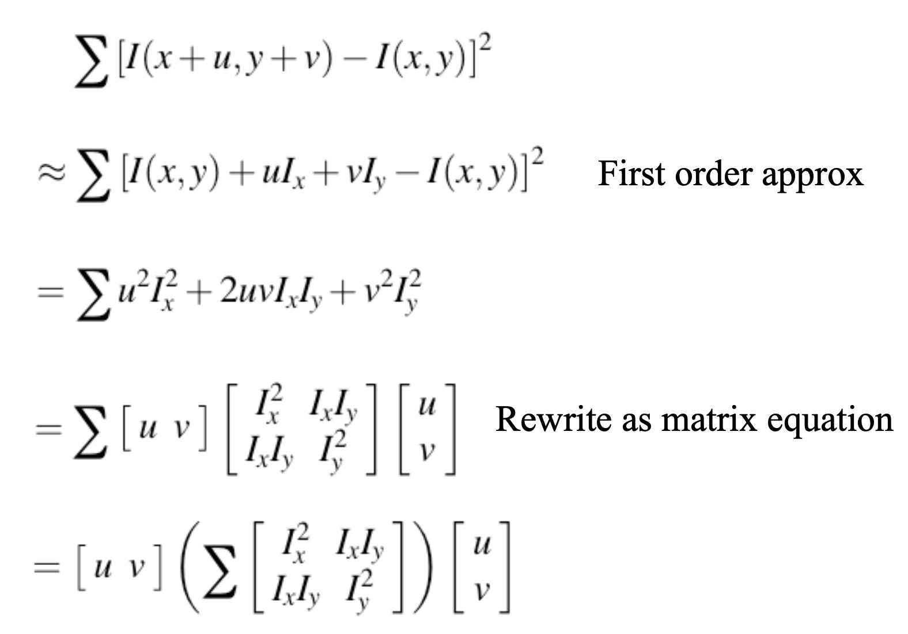
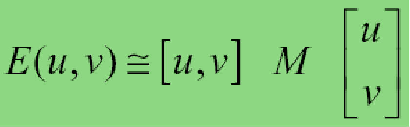
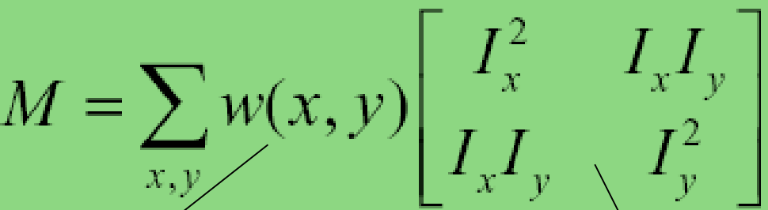
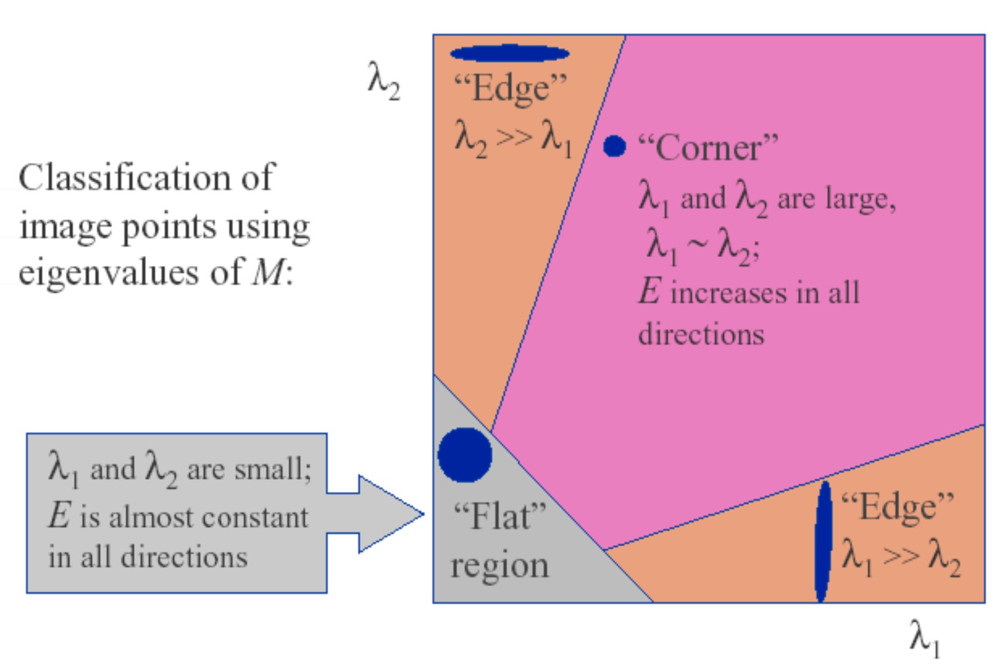
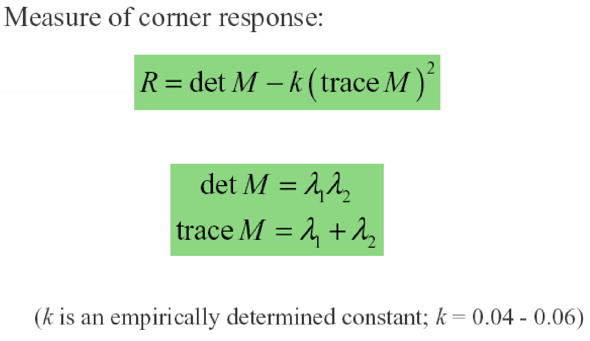
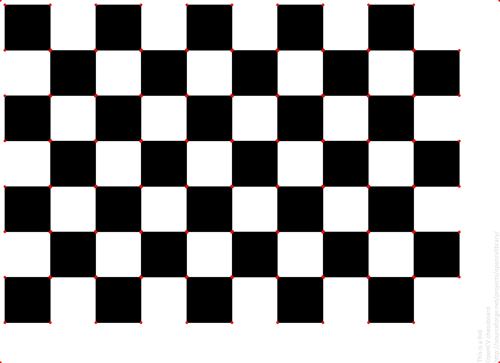

# 一步步用c++实现harris角点检测

## 0 简介

作为新一篇的一步步用c++实现算法，本文从0用c++实现计算机视觉中较为常用的harris角点检测算法，代码实现上不追求高性能，只为了帮助了解算法原理，通过最简单的实现加深对算法的理解。

## 1 算法简介

特征点在图像中一般有具体的坐标，并具有某些数学特征，如局部最大或最小灰度、以及某些梯度特征等。角点可以简单的认为是两条边的交点，比较严格的定义则是在邻域内具有两个主方向的特征点，也就是说在两个方向上灰度变化剧烈。如下图所示，在各个方向上移动小窗口，如果在所有方向上移动，窗口内灰度都发生变化，则认为是角点；如果任何方向都不变化，则是均匀区域；如果灰度只在一个方向上变化，则可能是图像边缘。

<center class="half">


</center>

所以，我们可以用下面的式子来描述当窗口发生位移（u,v）时，图像的变化情况：
$$
E(u, v)=\Sigma_{x} \Sigma_{y} w(x, y)[I(x+u, y+v)-I(x, y)]^{2}
$$

其中I(x,y)表示图像，可以理解为在当前位置的灰度值，其中w(x,y)为窗口函数，可以都为1，也可以是高斯核。

那么，我们只要使E在任意方向滑动的时候都很大，我们就能确定当前位置是角点。

怎么确定呢？

首先，对I(x+u, y+v)进行一阶泰勒展开，如下图所示，
<center class="half">





</center>

其中Ix代表x方向梯度，Iy代表y方向梯度。现在E(u, v)可以表示成矩阵的形式，也就是我们想让u，v取任意值的时候E都尽量大，其中E可以看作是关于uv的二次曲线，是一个椭圆。且M为实对称矩阵，可相似对角化，所以E可以约等于下式：

<center class="half">


</center>

通过式子可知，E为关于uv的椭圆函数，所以我们需要$\lambda_1$和$\lambda_2$同时为较大值的时候，E才会大。
<center class="half">



</center>

那么为了方便计算和描述$\lambda_1$和$\lambda_2$同时很大的情况，我们用下式来表示和描述这种情况：

<center class="half">



</center>
其中R为每个像素点的得分，之后我们进行阈值操作和nms，就得到了最终的角点。

## 2.算法实现

#### (1) 分别计算x和y方向的梯度Ix，Iy，和梯度的乘积Ixx，Iyy，Ixy

```
cv::Mat sobelx = (cv::Mat_<float>(3,3) << -1, 0, 1, -2, 0, 2, -1, 0, 1);
cv::Mat sobely = (cv::Mat_<float>(3,3) << -1, -2, -1, 0, 0, 0, 1, 2, 1);
cv::Mat Ix= filter_uchar(in_,sobelx);
cv::Mat Iy= filter_uchar(in_,sobely);
Ixx = Ix.mul(Ix);
Iyy = Iy.mul(Iy);
Ixy = Ix.mul(Iy);
```

#### (2) 使用窗口函数对Ixx，Iyy，Ixy进行高斯加权

```
Ixx = filter_float(Ixx,kernel);
Iyy = filter_float(Iyy,kernel);
Ixy = filter_float(Ixy,kernel);
```

#### (3) 遍历图像，在每个位置构建M矩阵，并计算响应值R

```
cv::Mat score_img(const cv::Mat &in_)
{
    cv::Mat res = cv::Mat::zeros(in_.size(),CV_32FC1);
    for (int r = 0; r < in_.rows; r++)
    {
        for(int c = 0; c < in_.cols; c++)
        {
            cv::Mat M = (cv::Mat_<float>(2,2)<<Ixx.at<float>(r,c),Ixy.at<float>(r,c),Ixy.at<float>(r,c),Iyy.at<float>(r,c));
            float score = cv::determinant(M) - 0.05*cv::trace(M)[0]*cv::trace(M)[0];
            res.at<float>(r,c) = score;
        }
    }
    return res;
}
```

#### (4) 阈值化处理得到corners

```
void get_corners(const cv::Mat &res_,const float thresh_ ,std::vector<cv::Point> &corners_)
{
    corners_.clear();
    for (int r = 0; r < res_.rows; r++)
    {
        for(int c = 0; c < res_.cols; c++)
        { 
            if (res_.at<float>(r,c)>thresh_)
            {
                corners_.emplace_back(c,r);
            }
        }
    }
}
```

## 结论

    harris算法程序实现较为简单，但是理论推导较为巧妙。且本文实现时未考虑图像边缘，也就是图像四角，并且检测后的角点，未做nms处理，结果图如下图所示。





## 参考文献

- https://www.bilibili.com/video/BV1Wb411b79B/?spm_id_from=333.788.recommend_more_video.0
- https://senitco.github.io/2017/06/18/image-feature-harris/
- http://www.cse.psu.edu/~rtc12/CSE486/lecture06.pdf
- https://docs.opencv.org/master/dc/d0d/tutorial_py_features_harris.html